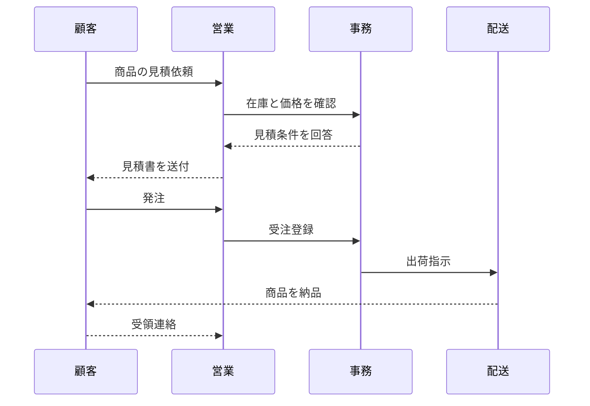

# MarkdownViewer

MarkdownViewer は、ローカルの **Markdown / HTML / JSON** ファイルを扱うための、**単体 HTML ベースの 3 ペインビューア** です。  
Chrome / Edge 系ブラウザを想定し、**閲覧・編集・プレビュー確認** を 1 画面で行えるようにしています。

- 左ペイン: **ファイル一覧**
- 中央ペイン: **プレビュー**
- 右ペイン: **エディタ**

この README は、現在の最新版 **`MarkdownViewer_v36_fav_delete_confirm.html`** の仕様に合わせています。

---

## 対応ファイル

- `.md`
- `.html`
- `.htm`
- `.json`

---

## 全体構成

### 左ペイン
- ファイル一覧
- ファイル名で絞り込み
- 隠しファイル / 隠しフォルダ表示切替
- 拡張子フィルタ
- 展開深さ指定
- お気に入り操作

### 中央ペイン
- Markdown / HTML / JSON のプレビュー
- Markdown アウトライン表示
- 現在ファイル再読込

### 右ペイン
- Markdown / JSON 編集
- プレビュー反映
- 保存

---

## 上部ツールバー

### ルートフォルダを選択
- File System Access API を使ってルートフォルダを選択します
- ここで開いた場合のみ、元ファイルへの保存が可能です

### 前回フォルダ再利用
- 前回選択したフォルダを再利用します
- ブラウザ側に権限が残っていれば、そのまま開けます

### 更新
- 左ペインのファイル一覧を更新します
- 現在表示中の本文は自動では再読込しません

### 自動更新: ON / OFF
- 一定間隔で左ペイン一覧を更新します
- 間隔は秒単位で設定できます

### 間隔
- 数値入力で自動更新の秒数を指定します

### エディタ 表示/非表示
- 右ペインの表示 / 非表示を切り替えます

### テーマ切替
- **ライト**
- **ダーク**

### ステータス表示
- `0 files` のようなファイル数表示
- `記憶: 保存済み / 一時のみ / なし / 非対応`
- ルートパス表示

---

## 左ペイン: ファイル一覧

### ファイル一覧
- 選択したルートフォルダ配下の `.md / .html / .htm / .json` を再帰表示
- フォルダ構造を維持したツリー表示
- 現在開いているファイルをハイライト表示

### ファイル名で絞り込み
- ファイル名や相対パスの一部で絞り込めます

### 拡張子フィルタ
選択可能:
- `すべて`
- `.md`
- `.html`
- `.json`

補足:
- `.html` には `.htm` も含みます

### 隠し
- `.` で始まるファイル / フォルダの表示を切り替えます
- 例: `.opencode` など
- 設定は記憶されます

### 展開
選択可能:
- `0` ～ `10`
- `すべて`

用途:
- 深い階層のファイルまで自動展開したい場合に使用します

### ファイル選択時の動作
- 左ペイン全体を毎回再描画せず、選択ハイライトだけ更新します
- そのため、展開状態やスクロール位置が崩れにくくなっています

---

## 左ペイン下部: お気に入り

よく使うフォルダを **お気に入り** として登録できます。

### 操作
- **お気に入り登録**
- **開く**
- **編集**
- **削除**
- **↑**
- **↓**

### 編集できる内容
- お気に入り名
- **メモ入力（フルパス等）**

### メモについて
ブラウザの仕様上、FileSystemHandle から **本物のフルパスを直接取得することはできません**。  
そのため、フルパス等は **表示用メモ** として手入力で保持します。

### マウスオーバー表示
- お気に入り選択欄にマウスオーバーすると、保存済みメモを表示します

### 並び替え
- `↑` / `↓` ボタンで選択中のお気に入りを上下に移動できます
- 並び順は保存されます

### 削除確認
- 削除ボタン押下時に確認メッセージを表示します

---

## 中央ペイン: プレビュー

### Markdown
Markdown を HTML として表示します。

対応例:
- 見出し
- 箇条書き
- コードブロック
- テーブル
- 引用
- リンク
- 画像
- 水平線

### Mermaid 対応
Markdown 内の `mermaid` コードブロックを描画できます。

例:



### HTML
- `iframe` で表示します
- HTML はプレビュー専用です

### JSON
- 整形表示
- 折りたたみ可能なツリー表示
- **すべて展開**
- **すべて折りたたむ**

不正な JSON の場合は、整形テキスト表示にフォールバックします。

### 現在ファイル再読込
- 開いているファイル本文だけを再読込します
- 一覧更新とは分離されています

---

## 中央ペイン内: アウトライン

Markdown の `h1` ～ `h6` からアウトラインを自動生成します。

### 機能
- **アウトライン: ON / OFF**
- 中央ペイン内の左側に表示
- 独立スクロール
- 追従表示
- 幅変更可能
- 項目クリックで該当見出しへ移動

### アウトラインクリック時の連動
- **プレビュー側** を該当見出しへスクロール
- **エディタ側** も対応する見出し位置へスクロール

### 記憶
- ON / OFF
- 幅

を記憶します。

---

## 右ペイン: エディタ

### 編集対象
- Markdown
- JSON

HTML は編集対象外です。

### ボタン
- **プレビュー反映**
- **保存**

### 保存
- `ルートフォルダを選択` で開いた Markdown / JSON は保存可能です
- HTML は保存対象外です

### スクロール同期
Markdown 表示時は、中央プレビューと右エディタのスクロールを同期します。

補足:
- 行単位ではなく、**全体高さの比率ベース** の同期です
- Markdown 原文と描画後 HTML の高さは一致しないため、この方式を採用しています

---

## ドラッグ＆ドロップ対応

画面全体へ `.md / .html / .htm / .json` を **ドラッグ＆ドロップ** して開けます。

### 仕様
- 左ペインのツリーは維持
- ドロップしたファイルは **一時ファイル** として開く
- 中央 / 右ペインだけで内容を表示
- 種別表示に `一時ファイル` を付加

### 制限
- ドラッグ＆ドロップで開いた一時ファイルは **上書き保存できません**
- 保存ボタン押下時は、その旨のメッセージを表示します

---

## ペイン幅調整

ドラッグで幅変更可能:
- 左ペイン ↔ 中央ペイン
- 中央ペイン ↔ 右ペイン
- アウトライン ↔ プレビュー

変更した幅は保存され、次回起動時にも復元されます。

---

## テーマ

### 対応テーマ
- ライト
- ダーク

### テーマ連動するもの
- 背景色
- パネル色
- テキスト色
- ボタン色
- スクロールバー色
- splitter 色

---

## 自動更新の仕様

### 自動更新で行うこと
- ルートフォルダ配下の対象ファイル再走査
- 左ペイン一覧更新
- 開いているファイルへの参照情報更新

### 自動更新で行わないこと
- 現在表示中ファイル本文の再読込
- プレビューの自動再描画
- エディタ内容の自動上書き

### 補足
現在の実装では、**Markdown 編集中にエディタへフォーカスがある場合**、  
自動更新をスキップする動作があります。

---

## 保存される設定

### localStorage
- テーマ
- エディタ表示 / 非表示
- 自動更新 ON / OFF
- 自動更新間隔
- 前回開いていたファイルパス
- 左ペイン幅
- 右ペイン幅
- アウトライン表示 ON / OFF
- アウトライン幅
- 拡張子フィルタ
- 隠しファイル表示 ON / OFF
- 展開深さ
- お気に入りID一覧
- お気に入り名 / メモ

### IndexedDB
- 前回選択したルートフォルダの FileSystemHandle
- お気に入りフォルダの FileSystemHandle

---

## 動作要件

### 推奨ブラウザ
- Google Chrome
- Microsoft Edge

### 使用 API
- File System Access API
- IndexedDB
- localStorage

---

## 制約・注意点

### 1. ブラウザ単体 HTML の制約
このツールは単体 HTML として動作します。  
そのため、HTML ファイル自身の場所は分かっても、その親フォルダ配下をブラウザが自動列挙することはできません。

### 2. 最初に必要な操作
最初に **「ルートフォルダを選択」** が必要です。

### 3. 編集対象
- 編集可能: Markdown / JSON
- プレビュー専用: HTML

### 4. フルパス
ブラウザの仕様上、本物のフルパスは取得できません。  
お気に入りのメモは、表示用に手入力する文字列です。

### 5. スクロール同期
完全一致ではなく、比率ベース同期です。

---

## 想定用途
- ローカル Markdown ドキュメントの閲覧
- README / 手順書 / 設計メモの確認
- Markdown / JSON 編集とプレビュー確認
- Mermaid を含む技術文書の閲覧
- ドキュメントフォルダの横断確認

---

## トラブルシュート

### ルートフォルダ選択が動かない
- Chrome / Edge で開いているか確認
- File System Access API が使える環境か確認
- 制限の強い環境では動かない場合があります

### 前回フォルダ再利用が効かない
- ブラウザが前回権限を保持していない可能性があります
- その場合は再度ルートフォルダを選択してください

### Mermaid が表示されない
- コードブロックが ` ```mermaid ` 形式か確認
- 記法エラーがないか確認

### アウトラインが出ない
- Markdown ファイルを開いているか確認
- 見出しが存在するか確認
- アウトラインが OFF になっていないか確認

### JSON が折りたためない
- JSON の構文が正しいか確認
- 不正な JSON の場合はテキスト表示になります

### 隠しファイルが見えない
- 左ペイン上部の **`隠し`** を ON にしてください

---

## 補足
必要に応じて以下を追記してください。
- ライセンス
- 更新履歴
- 作成者
- 配布方法
- 既知の制限事項
